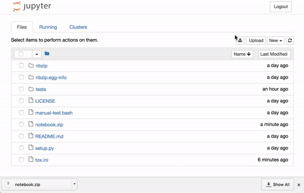

# nbzip
nbzip provides a button to zip and download a jupyter server folder.

# Installation

    pip install nbzip

You can then enable the serverextension

    jupyter serverextension enable --py nbzip --sys-prefix
    jupyter nbextension install --py nbzip
    jupyter nbextension enable --py nbzip
